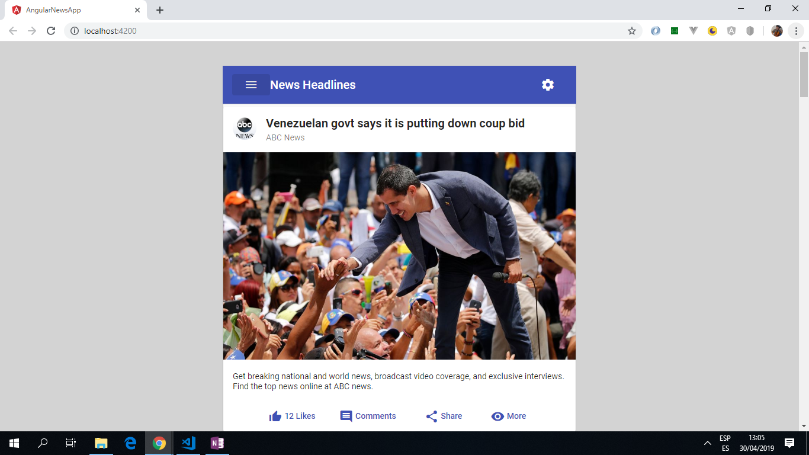

# :zap: Angular News App

* Gets API news data and displays it in a format suitable for viewing on a phone.
* Displays a left hand side navigation bar that allows the user to select a news channel. A single column displays news articles from this news channel.
* The News API service from [newsapi](https://newsapi.org) is used to generate the articles. It now only works on localhost. It will not work when deployed due to CORS errors (error 406) which means they want you to pay a subscription to fully access the API.
* Code from [article by Rashid Sakara](https://www.smashingmagazine.com/2018/10/news-application-with-angular-and-material-design/) - see [:clap: Inspiration](#clap-inspiration) below
* **Note:** to open web links in a new window use: _ctrl+click on link_


## :page_facing_up: Table of contents

* [:zap: Angular News App](#zap-angular-news-app)
  * [:page_facing_up: Table of contents](#page_facing_up-table-of-contents)
  * [:books: General info](#books-general-info)
  * [:camera: Screenshots](#camera-screenshots)
  * [:signal_strength: Technologies](#signal_strength-technologies)
  * [:floppy_disk: Setup](#floppy_disk-setup)
  * [:computer: Code Examples](#computer-code-examples)
  * [:cool: Features](#cool-features)
  * [:clipboard: Status & To-Do List](#clipboard-status--to-do-list)
  * [:clap: Inspiration](#clap-inspiration)
  * [:file_folder: License](#file_folder-license)
  * [:envelope: Contact](#envelope-contact)

## :books: General info

* Uses the model-view-viewmodel (MVVM) of Angular to bind the remote data that is stored in objects in the application template. The component plays the part of the controller/viewmodel. The template represents the view.
* Very basic app to show news, does not use reactive programming best practices - specified function return types, typescript models, etc....

## :camera: Screenshots

.

## :signal_strength: Technologies

* [Angular v15](https://angular.io/)
* [RxJS Library v7](https://angular.io/guide/rx-library) used to [subscribe](http://reactivex.io/documentation/operators/subscribe.html) to the API data [observables](http://reactivex.io/documentation/observable.html).
* [News REST API v2](https://newsapi.org/) used to search for news articles.
* [Angular Material Design v15](https://material.angular.io/) used for the user interface, especially [mat-menu](https://material.angular.io/components/menu/overview), [mat-sidenav](https://material.angular.io/components/sidenav/overview),  [mat-card](https://material.angular.io/components/card/overview) etc.

## :floppy_disk: Setup

* Install dependencies using `npm i`
* Get yourself a free API key from `www.newsapi.org` and add it to `news-api.service.ts`
* Run `ng serve` for a dev server. Navigate to `http://localhost:4200/`. The app does automatically reload if you change any of the source files.

## :computer: Code Examples

* `news-api.service.ts` to get API news data using Angular httpClient module.

```typescript

import { Injectable } from '@angular/core';
import { HttpClient  } from '@angular/common/http';


@Injectable({
  providedIn: 'root'
})
export class NewsApiService {

  api_key = 'YOUR API KEY';

  constructor(private http: HttpClient) { }
  initSources() {
     return this.http.get('https://newsapi.org/v2/sources?language=en&apiKey=' + this.api_key);
  }
  initArticles() {
   return this.http.get('https://newsapi.org/v2/top-headlines?sources=techcrunch&apiKey=' + this.api_key);
  }
  getArticlesByID(source: String) {
   return this.http.get('https://newsapi.org/v2/top-headlines?sources=' + source + '&apiKey=' + this.api_key);
  }
}

```

## :cool: Features

* [Angular HttpClient](https://angular.io/guide/http) module used to communicate with back-end services via the XMLHttpRequest browser interface.

## :clipboard: Status & To-Do List

* Status: Working.
* To-Do: Nothing.

## :clap: Inspiration

* [article by Rashid Sakara on building a news application using Angular 6 and Google’s Material Design](https://www.smashingmagazine.com/2018/10/news-application-with-angular-and-material-design/)

## :file_folder: License

* This project is licensed under the terms of the MIT license.

## :envelope: Contact

* Repo created by [ABateman](https://github.com/AndrewJBateman), email: gomezbateman@yahoo.com
